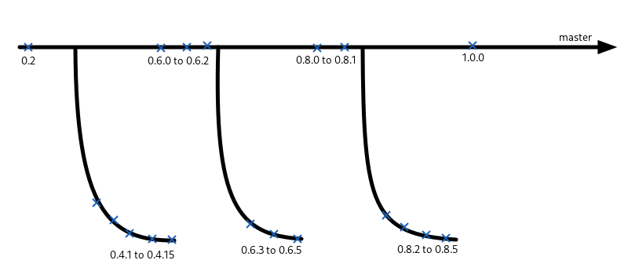

How to contribute to Drawing

- [If you find a bug](#bug-reports)
- [If you want a new feature](#feature-requests)
- [If you want to **translate** the app](#translating)
- [If you want to fix a bug or to add a new feature](#contribute-to-the-code)
- [How to install from the source code](#install-from-source-code)
- [If you want to **package** the app](#packaging)

----

# Bug reports

- If you can, try to **check if the bug has already been reported**
	- See [here](https://github.com/maoschanz/drawing/issues?q=is%3Aissue)
	- Some bugs might be already fixed but not released!
- Report it with information required by the adequate issue template.
- If it's meaningful, try to include screenshots.

----

# Feature requests

- If you can, try to **check if the feature has already been requested**.
	- See [here](https://github.com/maoschanz/drawing/issues?q=is%3Aissue)
	- Some features might be already implemented but not released!
- Report it with information required by the adequate issue template.
- In the report, explain **what** it does, **not how** it does it.

----

# Translating

Notice that this procedure will translate the unstable, unreleased version
currently developed on the `master` branch.

>You don't have to update your translation each time i update the files!

>Doing it just before the planned date of a major release should be enough;
>there are around two major releases per year, and 1 minor release per month.

>Their planned dates are written in `debian/changelog`.

### Get the .po file

- Fork the repo and clone your fork on your disk (see [installation instructions here](#with-gnome-builder-and-flatpak))
- **If the translation exists but is incomplete:**
	- Find the file corresponding to your language in the the `po` directory.
- **If the translation doesn't exist at all:**
	- Add your language to `po/LINGUAS`
	- Run `msginit -i po/drawing.pot --locale=xx -o po/xx.po`, where `xx` should
	be replaced by the ISO code of your language. This command will create a
	`.po` file for your language in the `po` directory.

### Translate

Use [an adequate app](https://flathub.org/apps/details/org.gnome.Gtranslator) or
a text editor to translate the strings of this `.po` file.

Concerning the "original version" in english: i'm **not** a native english
speaker, so there might be mistakes. If you find incorrect english labels,
please report an issue about them.

##### Comments

There are comments in the `.po` file to give context helping you to translate
some strings, please take them into account.

Example of something translators can't guess so it's written in the comments:
since this app is a clone of MS Paint, `Paint;` (untranslated) has to be in the
list of keywords for finding the app in searchable menus or "software stores"
apps or websites.

### Testing your translation (optional)

If you want to test your translation:

- The flatpak SDK isn't able to run a translated version of the app, so
export it as a `.flatpak` file and install it with `flatpak install path/to/that/file`.
- Or (it's harder) [install it with `meson`](#with-git-and-meson).

### Submitting your translation

- Run `git add po && git commit && git push`
- Submit a "pull request"/"merge request"

----

# Contribute to the code

- It's better if an issue you fix is reported first
- Tell on the issue that you'll try to fix it

**If you find anything weird in the code, or don't understand it, feel free to
ask me about it.**

To set up a development environment, see [here](#install-from-source-code).

>**[Technical explanations about the code and its design](./documentation)**

----

# Install from source code

You will not get updates with this installation method so please do that only
for contributing to development, translations, testing, or packaging.

### With GNOME Builder and flatpak

This app is developed using _GNOME Builder_ and its support for `flatpak`:

- Open _GNOME Builder_
- Click on "Clone a repository…" and use this address: `https://github.com/maoschanz/drawing.git`
- Open it as a project with GNOME Builder
- Be sure the runtime is installed (if it doesn't suggest it automatically, do
<kbd>Ctrl</kbd>+<kbd>Return</kbd> and type `update-dependencies`)
- Click on the _Run_ button

### With `git` and `meson`

See [here](#dependencies) for the list of dependencies.

#### 1) Get the code

```sh
git clone https://github.com/maoschanz/drawing.git
```

#### 2) Build the app

```sh
cd drawing
meson _build
ninja -C _build
```

##### Custom meson options

I have added 2 options you can use when you setup the project with `meson`:

- `enable-translations-and-appdata`
- `use-uuid-as-binary-name`

Their name are clear enough. Using the first one should allow you to have less
build dependencies, but i don't really test these options so you may have to
report issues about it.

Example:

```sh
cd drawing
meson -Denable-translations-and-appdata=false _build
ninja -C _build
```

#### 3) Install the app

```sh
sudo ninja -C _build install
```
(it installs the app system-wide. If you know the options to install user-wide,
please tell me)

The app can then be removed with:
```sh
cd _build
sudo ninja uninstall
```

### Others

<details><summary>With flatpak-builder (not recommended, that's just for me)</summary>
<p>

Initial setup of the local flatpak repository:
```sh
wget https://raw.githubusercontent.com/maoschanz/drawing/master/com.github.maoschanz.drawing.json
flatpak-builder --force-clean _build2/ --repo=_repo com.github.maoschanz.drawing.json
flatpak --user remote-add --no-gpg-verify local-drawing-repo _repo
flatpak --user install local-drawing-repo com.github.maoschanz.drawing
```

Update:
```sh
flatpak-builder --force-clean _build2/ --repo=_repo com.github.maoschanz.drawing.json
flatpak update
```

</p>
</details>

You can also build a debian package with the script `deb_package.sh`, but you
won't get updates that way, so don't do that. You probably don't have all the
dependencies to make the script work anyway.

----

# Packaging

### Branches and tags

Stable versions for end-users are **tagged**, and listed in this Github repo's
["_Releases_" section](https://github.com/maoschanz/drawing/releases).

Most tags are **not** on the `master` branch:



**Please don't package anything aside these tagged versions of the code**
<details><summary>(except if your distro has experimental repos)</summary>
<p>

<a href=https://wiki.debian.org/DebianExperimental>How to set up the debian
experimental repository</a>

```sh
sudo apt -t experimental install drawing
```

</p>
</details>

### Dependencies

(Debian packages names are used here)

##### Dependencies to run the app

- GObject Introspection (GI) for python3 (on Debian, it's `python3-gi`).
- `cairo` library's GI for python3 (on Debian, it's `python3-gi-cairo`).
- GTK libraries' GI (on Debian, it's `gir1.2-gtk-3.0`).

Minimal versions of the dependencies:

|                 | `python3-gi` | `python3-gi-cairo` | `gir1.2-gtk-3.0` |
|-----------------|--------------|--------------------|------------------|
| 0.2             | any          | any?               | 3.22             |
| --------------- | ------------ | ------------------ | ---------------- |
| 0.4.1, 0.4.2    | **≥3.30**    | any?               | 3.22             |
| 0.4.3 to 0.4.13 | any          | any?               | 3.22             |
| 0.4.14          | **≥3.32**    | any?               | 3.22             |
| 0.4.15          | any          | any?               | 3.22             |
| --------------- | ------------ | ------------------ | ---------------- |
| 0.6.0 to 0.6.1  | **≥3.32**    | any?               | 3.22             |
| 0.6.2           | **≥3.30**    | any?               | 3.22             |
| 0.6.3 to 0.6.5  | any          | any?               | 3.22             |
| --------------- | ------------ | ------------------ | ---------------- |
| 0.8.0, 0.8.1    | **≥3.30**    | any?               | 3.22             |
| 0.8.2 to 0.8.5  | any          | any?               | 3.22             |
| --------------- | ------------ | ------------------ | ---------------- |
| 0.1.0           | **≥3.30**    | any?               | 3.22             |
| --------------- | ------------ | ------------------ | ---------------- |
| `master`'s HEAD | **≥3.30**    | any?               | 3.22             |

##### Dependencies to **build** the app

Here, "optional" means you may succeed without them if you use the correct meson
options, the right building tools, and luck.

- `meson`. The version of meson required by the `meson.build` file at the root
of the project can be changed if necessary, but please don't add this change to
your commit(s).
- [optional] `appstream-util` (validation of the `.appdata.xml` file)
- `libglib2.0-dev-bin` (IIRC that one is to compress the `.ui` files and the
icons into a `.gresource` file: 100% necessary)
- [optional] `itstool` (to generate translation files for the help manual)

----

