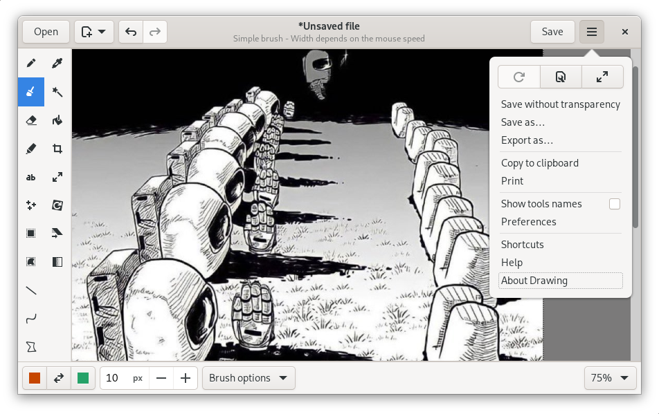

# Drawing

This simple image editor, similar to Microsoft Paint, is aiming at the GNOME
desktop.

PNG, JPEG and BMP files are supported.

Besides GNOME, the app is well integrated in traditional-looking desktops, as
well as [elementaryOS](./docs/screenshots/0.8/elementary_labels.png).

It should also be compatible with the *Pinephone* and *Librem 5*
[smartphones](./docs/screenshots/1.0/librem_menu.png).

## Screenshots

### Default user interface (for GNOME/Budgie)

[More screenshots](https://maoschanz.github.io/drawing/gallery.html)

----

## Installation

### Last stable version

>**Recommended**

You can install it from flathub.org using the instructions on
[this page](https://flathub.org/apps/details/com.github.maoschanz.drawing).

.

### Other packages available

- Ubuntu 18.04, 20.10 and 21.04: [PPA](https://launchpad.net/~cartes/+archive/ubuntu/drawing/)
- [Gentoo package](https://gitlab.com/src_prepare/src_prepare-overlay/-/tree/master/media-gfx/drawing) from an external overlay
- ["Snap" package](https://snapcraft.io/drawing)

### Unstable/nightly version

[See here](./CONTRIBUTING.md#install-from-source-code) to install and test the
app from source code.

----

### Available languages

If your language is not here, or is incompletely translated, you can
[contribute](./CONTRIBUTING.md#translating) to the translations.

| code | name         | complete*? | main translators                          |
|------|--------------|------------|-------------------------------------------|
| ar   | Arabic       | 65%        | @ContractISover                           |
| ca   | Catalan      | 93%        | @jordimas                                 |
| cs   | Czech        | 99%        | @pervoj                                   |
| da   | Danish       | 77%        | @scootergrisen                            |
| de   | German       | 100%       | @Etamuk                                   |
|      | English      | 100%       | help welcome **                           |
| es   | Castillan    | 100%       | @fitojb, @xoan, @oscfdezdz                |
| eu   | Basque       | 82%        | @alexgabi                                 |
| fi   | Finnish      | 99%        | @mahtiankka                               |
| fr   | French       | 100%       |                                           |
| he   | Hebrew       | **57%**    | @moriel5, @shaqash, @omeritzics           |
| hi   | Hindi        | **~20%**   | @sujaldev                                 |
| hr   | Croatian     | 97%        | @milotype                                 |
| hu   | Hungarian    | **48%**    | @kami911                                  |
| id   | Indonesian   | **59%**    | @ekickx                                   |
| it   | Italian      | 99%        | @amivaleo and @albanobattistella          |
| ja   | Japanese     | 86%        | @rlbxku1r                                 |
| kr   | Korean       | 90%        | @chaeya                                   |
| nl   | Dutch        | 97%        | @Vistaus                                  |
| oc   | Occitan      | **33%**    | @Mejans                                   |
| pl   | Polish       | 100%       | @pkomur                                   |
| pt_BR | Br. portuguese | 100%    | @haurenburu and @ArthurBacci64            |
| ru   | Russian      | 99%        | @tim77 and @Ser82-png                     |
| sv   | Swedish      | 99%        | @eson57                                   |
| tr   | Turkish      | 100%       | @TeknoMobil and @serkan-maker             |
| zh_CN | Chinese, simpl. | 61%    | @OverflowCat                              |
| zh_TW | Chinese, tradi. | 62%    | @pan93412, @OverflowCat and @cges30901    |

\*Completion percentages correspond to **the next** major version, still in
development.

\**Concerning the "original version" in english: all the labels are here, but
i'm **not** a native english speaker, so there might be mistakes. If you find
incorrect english labels, please report an issue about it.

----

### Tools

(last update: **version 1.0.0**)

*Tools in italic can be disabled.*

#### Classic tools

These tools have many options (colors, antialiasing, size, gradients, dashes,
outline style, …) that are not listed here.

- Pencil
- *Brushes (pressure sensitive):*
	- *Simple round brush*
	- *Hairy brush*
	- *Airbrush*
	- *Calligraphic nibs*
- *Eraser*
- *Highlighter*
- Line
- Curve
- Insert text
- *Insert points, to help captioning*
- Shape:
	- rectangle
	- rounded rectangle
	- circle
	- oval
	- polygon
	- free shape
- *Color picker*
- *Paint*

#### Selection tools

These tools allow you to define an area (rectangle or free), which you can move,
cut, copy, paste, edit with any transformation tool, export, open as a new
image, etc.

- Rectangle selection
- Free shape selection
- *Adjacent color selection*

#### Transformation tools

These tools can edit the whole image, or edit a selected part of it.

- Crop
- Scale
- Rotate (rotate or flip)
- Filters:
	- Saturation (increase or decrease)<!-- - Veil -->
	- Transparency
	- Increase contrast
	- Blur (various types)
	- Pixelization
	- Invert colors
- Skew

----

### Settings

The settings are managed by the `Gio.Settings` abstraction, which will probably
corresponds to the `dconf` database once the app is installed as a native
package.

With flatpak however, the settings are stored in a key-value file, which can be
found (and edited) at `~/.var/app/com.github.maoschanz.drawing/config/glib-2.0/settings/keyfile`.

----

[Donations (paypal)](https://paypal.me/maoschannz)

[To contribute](./CONTRIBUTING.md)

the code is under GPL3, some tools icons are from [here](https://github.com/gnome-design-team/gnome-icons/tree/master/art-libre-symbolic) or from the [Adwaita icon theme](https://gitlab.gnome.org/GNOME/adwaita-icon-theme).

