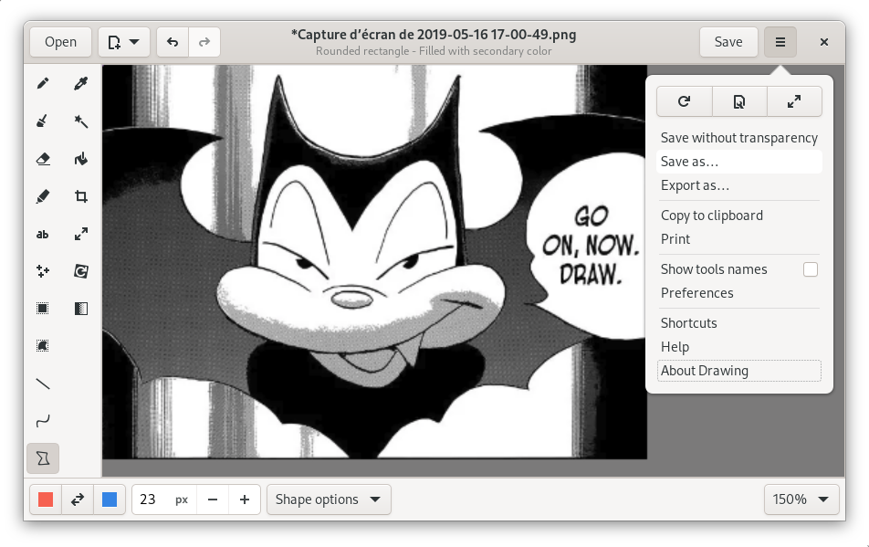

# Drawing

## A simple image editor for Linux

This is a basic drawing application, similar to Microsoft Paint, but aiming
at the GNOME desktop.

PNG, JPEG and BMP files are supported.

Besides GNOME, the app is well integrated in traditional-looking desktops, as
well as [elementaryOS](./docs/screenshots/0.8/elementary_labels.png).

It should also be compatible with the *Pinephone* and *Librem 5*
[smartphones](./docs/screenshots/0.6/librem_menu.png).

## Screenshots

### Default user interface (for GNOME/Budgie)

[More screenshots](https://maoschanz.github.io/drawing/gallery.html)

----

## Installation

### Last stable version

>**Recommended**

You can install it from flathub.org using the instructions on
[this page](https://flathub.org/apps/details/com.github.maoschanz.drawing).

.

### Other packages available

- Ubuntu 18.04, 20.10 and 21.04: [PPA](https://launchpad.net/~cartes/+archive/ubuntu/drawing/)
- [Gentoo package](https://gitlab.com/src_prepare/src_prepare-overlay/-/tree/master/media-gfx/drawing) from an external overlay
- ["Snap" package](https://snapcraft.io/drawing)

### Unstable/nightly version

[See here](./CONTRIBUTING.md#install-from-source-code) to install and test the
app from source code.

----

### Available languages

If your language is not here, or is incompletely translated, you can
[contribute](./CONTRIBUTING.md#translating) to the translations.

| code | name         | complete*? | main translators                          |
|------|--------------|------------|-------------------------------------------|
| cs   | Czech        | 100%       | @pervoj                                   |
| da   | Danish       | 82%        | @scootergrisen                            |
| de   | German       | 96%        | @Etamuk                                   |
|      | English      | 100%       | help welcome **                           |
| es   | Castillan    | 99%        | @fitojb, @xoan, @oscfdezdz                |
| eu   | Basque       | 84%        | @alexgabi                                 |
| fi   | Finnish      | **67%**    | @mahtiankka                               |
| fr   | French       | 100%       |                                           |
| he   | Hebrew       | **35%**    | @moriel5 and @shaqash                     |
| hr   | Croatian     | **69%**    | @milotype                                 |
| hu   | Hungarian    | **56%**    | @kami911                                  |
| id   | Indonesian   | 68%        | @ekickx                                   |
| it   | Italian      | 98%        | @amivaleo and @albanobattistella          |
| ja   | Japanese     | 96%        | @rlbxku1r                                 |
| kr   | Korean       | 95%        | @chaeya                                   |
| nl   | Dutch        | 97%        | @Vistaus                                  |
| pl   | Polish       | **64%**    | @pkomur)                                  |
| pt_BR | Br. portuguese | 72%     | @haurenburu and @ArthurBacci64            |
| ru   | Russian      | 96%        | @tim77 and @Ser82-png                     |
| sv   | Swedish      | 96%        | @eson57                                   |
| tr   | Turkish      | 95%        | @TeknoMobil and @serkan-maker             |
| zh_CN | Chinese, simpl. | 71%    | @OverflowCat                              |
| zh_TW | Chinese, tradi. | 72%    | @pan93412, @OverflowCat and @cges30901    |

\*Completion percentages correspond to **the next** major version, still in
development.

\**Concerning the "original version" in english: all the labels are here, but
i'm **not** a native english speaker, so there might be mistakes. If you find
incorrect english labels, please report an issue about it.

----

### Tools

(last update: **version 0.8.3**)

*Tools in italic can be disabled.*

#### Classic tools

General options for these tools: colors, use antialiasing, size, …

- Pencil (options: dashes, line shape, outline, …)
- *Brushes (pressure sensitive)*:
	- *Simple round brush*
	- *Hairy brush*
	- *Airbrush*
	- *Calligraphic nibs*
- *Eraser* (options: blur, mosaic, transparency, solid color, …)
- *Highlighter* (options: highlight on dark background)
- Line (options: arrow, dashes, gradient, …)
- Curve (options: arrow, dashes, …)
- Insert text (options: font, shadow/outline, font size, …)
- *Insert points (options: shape of the points, include a number, …) to help captioning*
- Shape (options: filling style, outline style, gradient, …):
	- rectangle
	- rounded rectangle
	- circle
	- oval
	- polygon
	- free shape
- *Color picker*
- *Paint (options: remove a color, …)*

#### Selection tools

These tools allow you to define an area (rectangle or free), which you can move,
cut, copy, paste, edit with any transformation tool, export, open as a new
image, etc.

- Rectangle selection
- Free shape selection
- *Adjacent color selection*

#### Transformation tools

These tools can edit the whole image, or edit a selected part of it.

- Crop
- Scale (options: keep proportions or not)
- Rotate (rotate or flip)
- Filters:
	- Saturation (increase or decrease)<!-- - Veil -->
	- Transparency
	- Increase contrast
	- Blur (various types)
	- Pixelization
	- Invert colors
- Skew (horizontally or vertically)

----

### Settings

The settings are managed by the `Gio.Settings` abstraction, which will probably
corresponds to the `dconf` database once the app is installed as a native
package.

With flatpak however, the settings are stored in a key-value file, which can be
found (and edited) at `~/.var/app/com.github.maoschanz.drawing/config/glib-2.0/settings/keyfile`.

----

[Donations (paypal)](https://paypal.me/maoschannz)

[To contribute](./CONTRIBUTING.md)

the code is under GPL3, some tools icons are from [here](https://github.com/gnome-design-team/gnome-icons/tree/master/art-libre-symbolic) or from the Adwaita theme.

