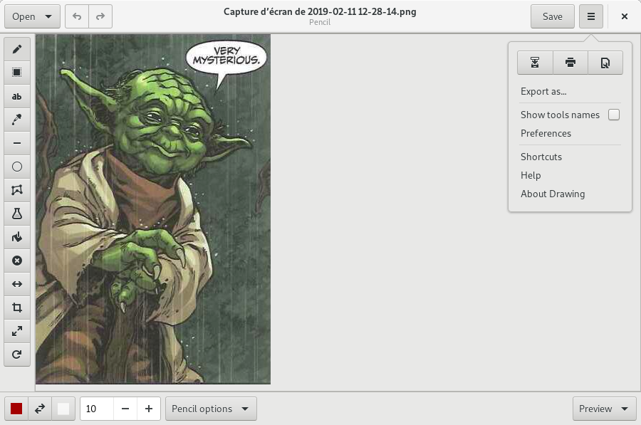

# Drawing

## A drawing application for the GNOME desktop.

>"This one looks great!" - [@omgubuntu](https://twitter.com/omgubuntu/status/1085923553525010433)

This application is a simple image editor using Cairo and GdkPixbuf for basic drawing operations.

It follows GNOME interface guidelines, but can optionally use elementarysOS UI guidelines or Cinnamon/MATE UI guidelines.

PNG, JPEG and BMP files are supported.

### Available tools

(and a few of their options)

| Tool      | Options   | Remarks   |
|:---------:|:---------:|:---------:|
|Pencil     |Dashes, eraser, ...|   |
|Shape      |Rectangle, circle, oval ; Filling
|Polygon, free shape |Filling|      |
|Line       |Straight line/Arc, arrow, dashes
|Insert text|Font and font size|    |
|Selection  |Rectangle/free shape|Drag, delete, cut, copy, export
|-          |           |Is activated when you paste or import an image
|Paint      |           |Not done yet
|Brush      |           |Not done yet
|Gradient   |           |Not done yet
|Color picker|          |           |
|Crop*      |           |The previewed picture isn't at the actual scale
|Flip*      |Horizontally or vertically
|Scale*     |Keep proportions or not
|Rotate*    |           |           |

\*Can be applied to the selection

### Languages

- Castillan
- English
- French
- Turkish

## Installation

### Stable version

TODO

### Unstable version from `master`

[See here](./INSTALL_FROM_SOURCE.md)

## Screenshots

(not up-to-date)

### GNOME/Budgie UI

Theorically compatible with the Purism Librem 5 phone.

<!-- TODO -->

More screenshots:

- [Color chooser](./data/screenshots/gnome_screenshot_colors.png)
- [Open/Import menu](./data/screenshots/gnome_screenshot_open.png)
- [Scaling the canvas](./data/screenshots/gnome_screenshot_scale.png)
- [The selection tool and its menu](./data/screenshots/gnome_screenshot_selection.png)
- [Drawing things on the picture with tools](./data/screenshots/gnome_screenshot_tools.png)

### elementarysOS UI

<!--TODO-->

### MATE/Cinnamon UI

If you like menubars

