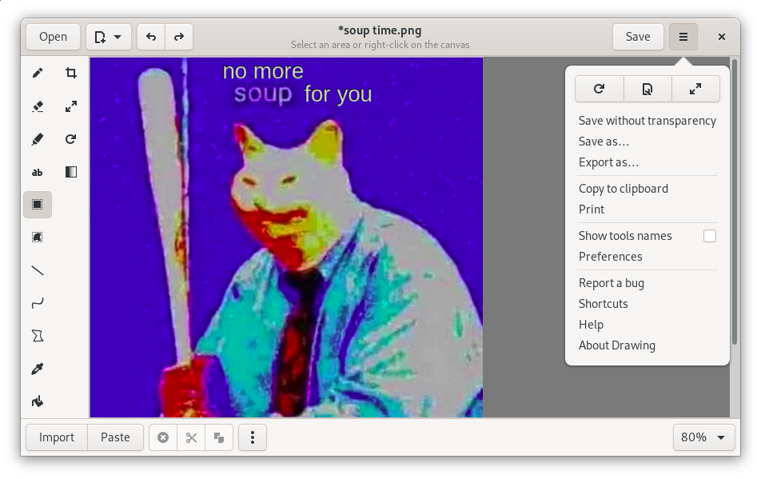

# Drawing

## A simple drawing application for Linux.

This application is a basic image editor, similar to Microsoft Paint, but aiming
at the GNOME desktop.

PNG, JPEG and BMP files are supported.

Besides GNOME, some more traditional design layouts are available too, as well
as an [elementaryOS layout](./docs/screenshots/0.6/elementary_save_as.png). It
should also be compatible with the *Pinephone* and *Librem 5*
[smartphones](./docs/screenshots/0.6/librem_menu.png).

## Screenshots

### Default user interface (for GNOME/Budgie)

[More screenshots](https://maoschanz.github.io/drawing/gallery.html)

----

## Installation

### Last stable version

>**Recommended**

You can install it from flathub.org using the instructions on
[this page](https://flathub.org/apps/details/com.github.maoschanz.drawing).

### Other packages available

- Ubuntu 18.04, 20.04, and 20.10: [PPA](https://launchpad.net/~cartes/+archive/ubuntu/drawing/)
- [Gentoo package](https://gitlab.com/src_prepare/src_prepare-overlay/-/tree/master/media-gfx/drawing) from an external overlay
- ["Snap" package](https://www.youtube.com/watch?v=dQw4w9WgXcQ)

### Unstable/nightly version

[See here](./CONTRIBUTING.md#install-from-source-code) to install and test the
app from source code.

----

### Available languages

If your language is not here, or is incompletely translated, you can
[contribute](./CONTRIBUTING.md#translating) to the translations.

| code | name         | since… | complete*? | main translators                 |
|------|--------------|--------|------------|----------------------------------|
| da   | Danish       | 0.4.10 | 93%        | [scootergrisen](https://github.com/scootergrisen)
| de_DE | German      | 0.4.1  | 100%       | [Onno Giesmann](https://github.com/Etamuk)
|      | English      | 0.2    | 100%       | help welcome **                  |
| es   | Castillan    | 0.2    | 88%        | [Adolfo Jayme-Barrientos](https://github.com/fitojb) and [Xoan Sampaiño](https://github.com/xoan)
| eu   | Basque       | 0.4.14 | 88%        | [alexgabi](https://github.com/alexgabi)
| fi   | Finnish      | 0.4.10 | 81%        | [MahtiAnkka](https://github.com/mahtiankka)
| fr   | French       | 0.2    | 100%       |                                  |
| he   | Hebrew       | 0.4.1  | **42%**    | [moriel5](https://github.com/moriel5) and [Shaked Ashkenazi](https://github.com/shaqash)
| hr   | Croatian     | 0.4.11 | 85%        | [Milo Ivir](https://github.com/milotype)
| hu   | Hungarian    | 0.4.10 | **68%**    | [Kálmán „KAMI” Szalai](https://github.com/kami911)
| id   | Indonesian   | 0.6.3  | 83%        | [Ghani Rafif](https://github.com/ekickx)
| it   | Italian      | 0.4.1  | 99%        | [Jimmy Scionti](https://github.com/amivaleo) and [Albano Battistella ](https://github.com/albanobattistella)
| nl   | Dutch        | 0.4.1  | 100%       | [Heimen Stoffels](https://github.com/Vistaus)
| pl   | Polish       | 0.4.10 | 78%        | [Piotr Komur](https://github.com/pkomur)
| pt_BR | Br. portuguese | 0.4.3 | 88%      | [Antonio Hauren](https://github.com/haurenburu) and [ArthurBacci64](https://github.com/ArthurBacci64)
| ru   | Russian      | 0.4.1  | **38%**    | [Artem Polishchuk](https://github.com/tim77)
| sv   | Swedish      | 0.4.11 | 100%       | [Åke Engelbrektson](https://github.com/eson57)
| tr   | Turkish      | 0.2    | 88%        | [Serdar Sağlam](https://github.com/TeknoMobil)
| zh_CN | Chinese, simpl. | 0.4.14 | 87%    | [OverflowCat](https://github.com/OverflowCat)
| zh_TW | Chinese, tradi. | 0.4.14 | 88%    | [pan93412](https://github.com/pan93412), [OverflowCat](https://github.com/OverflowCat), [張修銘](https://github.com/cges30901)

\*Completion percentages correspond to **the next** major version, still in
development.

\**Concerning the "original version" in english: all the labels are here, but
i'm **not** a native english speaker, so there might be mistakes. If you find
incorrect english labels, please report an issue about it.

----

### Tools

(last update: **version 0.6.3**)

*Tools in italic can be disabled.*

#### Classic tools

General options for these tools: colors, use antialiasing, size, …

- Pencil (options: dashes, line shape, …)
- *Eraser*
- *Highlighter* (options: highlight on dark background)
- Line (options: arrow, dashes, gradient, …)
- Curve (options: arrow, dashes, …)
- Insert text (options: font, shadow/outline, font size, …)
- *Insert points (options: shape of the points, include a number, …) to help captioning*
- Shape (options: filling style, outline style, gradient, …):
	- rectangle
	- rounded rectangle
	- circle
	- oval
	- polygon
	- free shape
- *Color picker*
- *Paint (options: remove a color, …)*

#### Selection tools

These tools allow you to define an area (rectangle or free), which you can move,
cut, copy, paste, edit with any transformation tool, export, open as a new
image, etc.

- Rectangle selection
- Free shape selection
- *Adjacent color selection*

#### Transformation tools

These tools can edit the whole image, or edit a selected part of it.

- Crop
- Scale (options: keep proportions or not)
- Rotate (rotate or flip)
<!-- - Skew (horizontally or vertically) -->
- Filters:
	- Blur (various types)
	- Pixelization
	- Saturation (increase or decrease)
	- Transparency
	- Invert colors
	- …

----

[Donations (paypal)](https://paypal.me/maoschannz)

[To contribute](./CONTRIBUTING.md)

the code is under GPL3, some tools icons are from [here](https://github.com/gnome-design-team/gnome-icons/tree/master/art-libre-symbolic)

