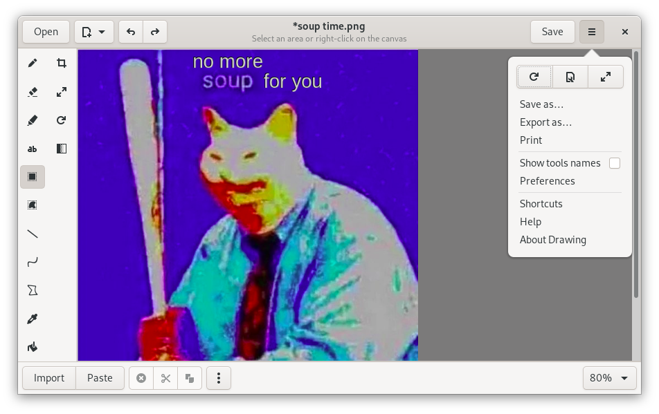
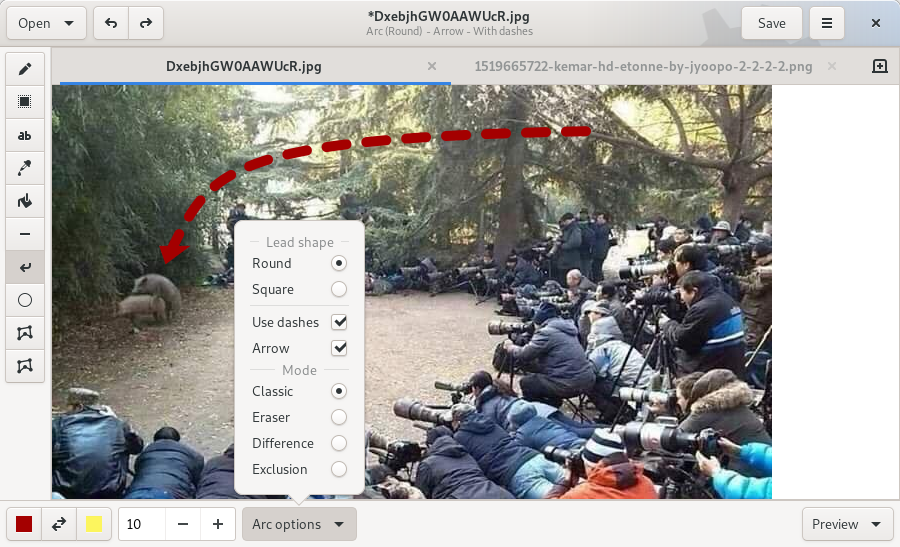
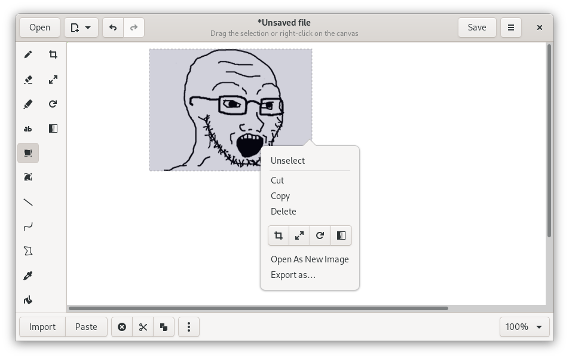
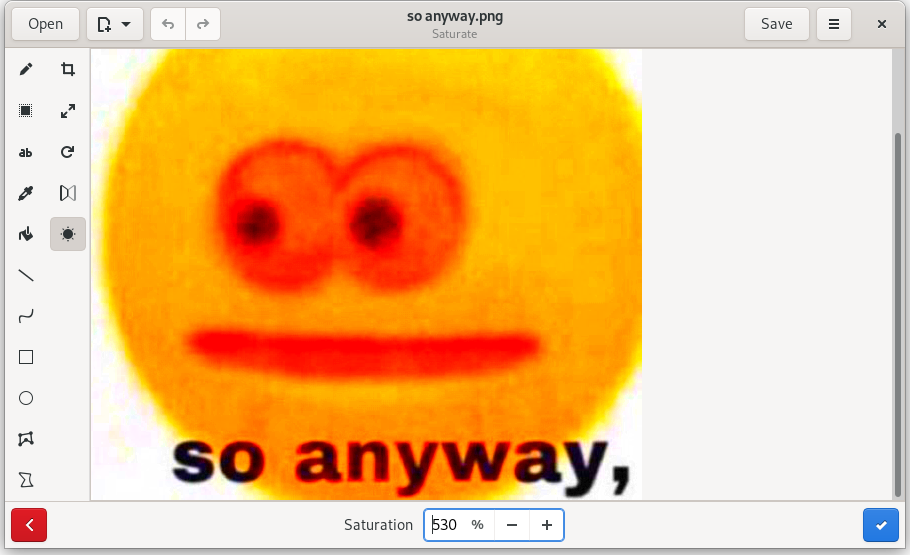

# Drawing (branch 0.4.x)

## A simple drawing application for Linux.

This application is a basic image editor, similar to Microsoft Paint, but aiming
at the GNOME desktop.

PNG, JPEG and BMP files are supported.

Besides GNOME, some more traditional design layouts are available too, as well
as an elementaryOS layout. It should also be compatible with smartphone screens
(Librem 5, PinePhone, etc.)

### Available tools

(and a few of their options)

Classic tools:

| Tool      | Options        |
|:---------:|:--------------:|
|Pencil     |Dashes, eraser, …|
|Line       |Arrow, dashes, gradient …
|Arc        |Arrow, dashes, …|
|Insert text|Font, outline/shadow, font size|
|Rectangle  |Filling         |
|Circle     |Regular circle or oval; Filling
|Polygon    |Filling         |
|Free shape |Filling         |
|Color picker|               |
|Paint      |Remove a color  |

The selection tool allows you to define an area (rectangle or free), which you
can move, cut, copy, paste, edit with canvas tools, export, open as a new image,
etc.

Canvas/selection edition tools:

| Tool      | Options   |
|:---------:|:---------:|
|Crop*      |           |
|Flip       |Horizontally or vertically
|Scale      |Keep proportions or not
|Rotate     |           |
|Saturate   |           |

\*Remark: The previewed picture isn't at the actual scale.

### Available languages

If your language is not here, or is incompletely translated, you can
[contribute](./CONTRIBUTING.md#translating) to the translations.

| code | name         | since | complete?  | main translators                  |
|------|--------------|-------|------------|-----------------------------------|
|      | English      | 0.2   | 100%       | help welcome *                    |
| fr   | French       | 0.2   | 100%       |                                   |

\*Concerning the "original version" in english: all the labels are here, but
i'm **not** a native english speaker, so there might be mistakes. If you find
incorrect english labels, please report an issue about it.

----

## Screenshots

These screenshots show the main default user interface (for GNOME/Budgie), but
there are other more traditional window layouts (with a menubar and/or a toolbar
using diffent styles of icons).

The default "GNOME" UI can be resized to be compatible with the Purism Librem 5
phone. [Screenshot](./docs/screenshots/librem_options.png) and
[screencast on Youtube](https://www.youtube.com/watch?v=xwfDnPd5NDU) (version 0.2).

----

## Installation

### Stable version

>**Recommended**

You can install it from flathub.org using the instructions on [this page](https://flathub.org/apps/details/com.github.maoschanz.drawing).

### Native packages

- Ubuntu: [PPA](https://launchpad.net/~cartes/+archive/ubuntu/drawing/)
- ["Snap" package](https://snapcraft.io/drawing)

