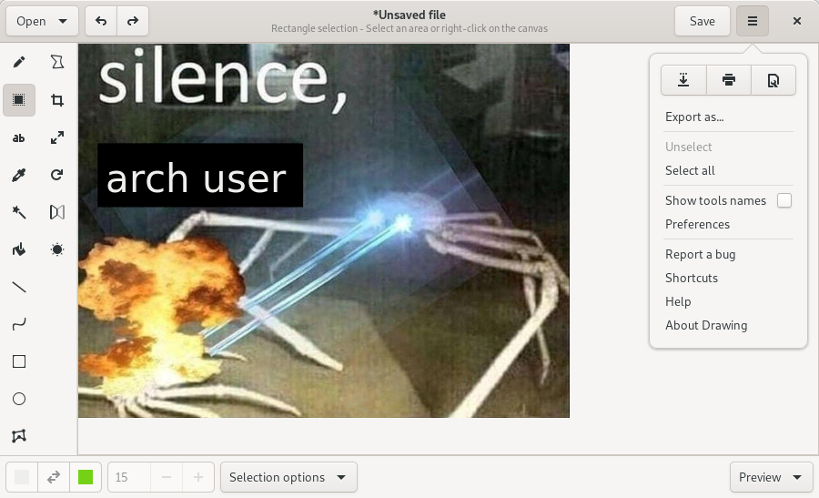

# Drawing

## A drawing application for the GNOME desktop.

This application is a simple image editor, using Cairo and GdkPixbuf for basic drawing operations.

It follows GNOME interface guidelines (but can optionally use elementarysOS UI guidelines or Cinnamon/MATE UI guidelines).

PNG, JPEG and BMP files are supported.

### Available tools

(and a few of their options)

Drawing tools:

| Tool      | Options   | Remarks |
|:---------:|:---------:|:-------:|
|Pencil     |Dashes, eraser, ...| |
|Shape      |Rectangle, circle, oval ; Filling
|Polygon, free shape |Filling|    |
|Line       |Arrow, dashes, ...|  |
|Arc        |Arrow, dashes, ...|  |
|Insert text|Font and font size|  |
|Selection  |Rectangle/free shape|Is auto-activated when you paste or import an image
|Color picker|          |         |

<!--|Paint      |           |Not done yet-->
<!--|Brush      |           |Not done yet-->
<!--|Gradient   |           |Not done yet-->

Canvas/selection edition tools:

| Tool      | Options   | Remarks |
|:---------:|:---------:|:-------:|
|Crop       |           |The previewed picture isn't at the actual scale
|Flip       |Horizontally or vertically
|Scale      |Keep proportions or not
|Rotate     |           |         |
|Saturate   |           |         |

### Available languages

- Castillan (thanks to [Adolfo Jayme-Barrientos](https://github.com/fitojb))
- English
- French
- Turkish (thanks to [Serdar Sağlam](https://github.com/TeknoMobil))

----

## Screenshots

### Default user interface (for GNOME/Budgie)

More screenshots:

- [Color chooser](./data/screenshots/gnome_colors.png)
- [Open/Import menu](./data/screenshots/gnome_open.png)
- [Scaling the canvas](./data/screenshots/gnome_scale.png)
- [The selection tool and its menu](./data/screenshots/gnome_selection.png)
- [Drawing things on the picture with tools](./data/screenshots/gnome_tools.png)
- [Inserting text](./data/screenshots/gnome_text.png)
- [Adjusting the saturation](./data/screenshots/gnome_menu_saturation.png)

### Alternative user interfaces

- [elementaryOS UI](./data/screenshots/elementary.png)
- [MATE/Cinnamon UI](./data/screenshots/mate_selection.png)
- The default UI can be resized to be [compatible with the Purism Librem 5 phone](./data/screenshots/librem_preview.png)

----

## Installation

### Stable version

TODO

### Unstable version from `master`

[See here](./INSTALL_FROM_SOURCE.md)

