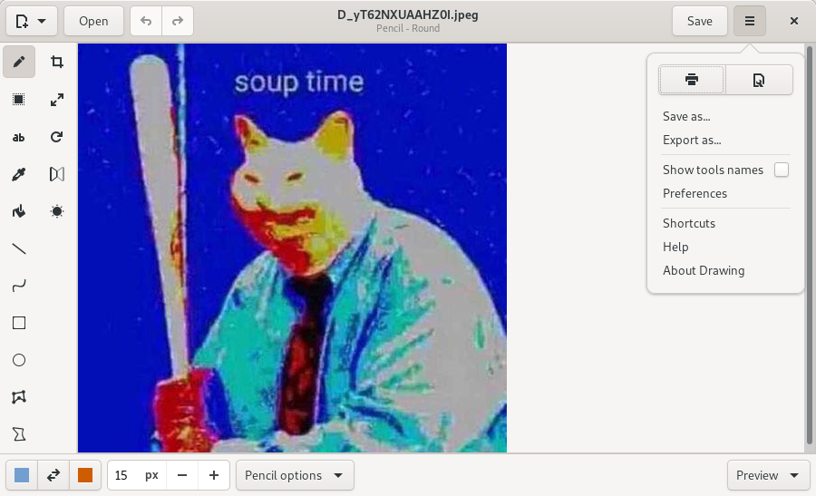

# Drawing

## A simple drawing application for Linux.

This application is a basic image editor, similar to Microsoft Paint, but aiming
at the GNOME desktop.

PNG, JPEG and BMP files are supported.

Besides GNOME, some more traditional design layouts are available too, as well
as an [elementaryOS layout](./docs/screenshots/elementary.png). It should also
be compatible with [Purism's Librem 5 phone](./docs/screenshots/librem_options.png).

## Screenshots

### Default user interface (for GNOME/Budgie)

[More screenshots](https://maoschanz.github.io/drawing/gallery.html)

----

## Installation

### Last stable version

>**Recommended**

You can install it from flathub.org using the instructions on [this page](https://flathub.org/apps/details/com.github.maoschanz.drawing).

### Other packages available

- Ubuntu 18.04, 19.10 and 20.04: [PPA](https://launchpad.net/~cartes/+archive/ubuntu/drawing/)
- ["Snap" package](https://snapcraft.io/drawing)

### Unstable/nightly version

[See here](./CONTRIBUTING.md#install-from-source-code)

----

### Available languages

- Brazilian portuguese (thanks to [Antonio Hauren](https://github.com/haurenburu))
- Castillan (thanks to [Adolfo Jayme-Barrientos](https://github.com/fitojb) and [Xoan Sampaiño](https://github.com/xoan))
- Croatian (thanks to [milotype](https://github.com/milotype))
- Danish (thanks to [scootergrisen](https://github.com/scootergrisen))
- Dutch (thanks to [Heimen Stoffels](https://github.com/Vistaus))
- English
- Finnish (thanks to [MahtiAnkka](https://github.com/mahtiankka))
- French
- German (thanks to [Onno Giesmann](https://github.com/Etamuk))
- Hebrew (thanks to [moriel5](https://github.com/moriel5) and [Shaked Ashkenazi](https://github.com/shaqash))
- Hungarian (thanks to [Kálmán „KAMI” Szalai](https://github.com/kami911))
- Italian (thanks to [Jimmy Scionti](https://github.com/amivaleo) and [Albano Battistella ](https://github.com/albanobattistella))
- Polish (thanks to [Piotr Komur](https://github.com/pkomur))
- Russian (thanks to [Artem Polishchuk](https://github.com/tim77))
- Swedish (thanks to [Åke Engelbrektson](https://github.com/eson57))
- Turkish (thanks to [Serdar Sağlam](https://github.com/TeknoMobil))

<!-- TODO add completion percentages, since he and ru for example are at ~50% -->

If your language is not here, or is incompletely translated, you can
[contribute](./CONTRIBUTING.md#translating) to the translations.

----

### Tools (0.5.3-unstable)

(last update: **version 0.5.3-unstable**, this is **NOT** what is provided by the packages)

#### Classic tools

(general options: colors, use blur or eraser, size, …)

- Pencil (options: dashes, …)
- Eraser
- Highlighter
- Line (options: arrow, dashes, gradient, …)
- Curve (options: arrow, dashes, …)
- Insert text (options: font, shadow, font size, …)
- Shape (options: filling style, gradient, …):
	- rectangle
	- rounded rectangle
	- circle
	- oval
	- polygon
	- free shape
- Color picker
- Paint (options: remove a color, …)

#### Selection tools

These tools allow you to define an area (rectangle or free), which you can move,
cut, copy, paste, edit with canvas tools, export, open as a new image, etc.

- Rectangle selection
- Free shape selection
- Adjacent color selection

#### Canvas/selection edition tools

These tools allow to edit the whole image, or to edit a selected part of it.

- Crop
- Scale (options: keep proportions or not)
- Rotate (rotate or flip)
- Skew (horizontally or vertically)
- Filters:
	- Blur (various types)
	- Saturation (increase or decrease)
	- Transparency
	- Invert colors
	- Pixelate

----

[Donations (paypal)](https://paypal.me/maoschannz)

[To contribute](./CONTRIBUTING.md)

the code is under GPL3, some tools icons are from [here](https://github.com/gnome-design-team/gnome-icons/tree/master/art-libre-symbolic)
